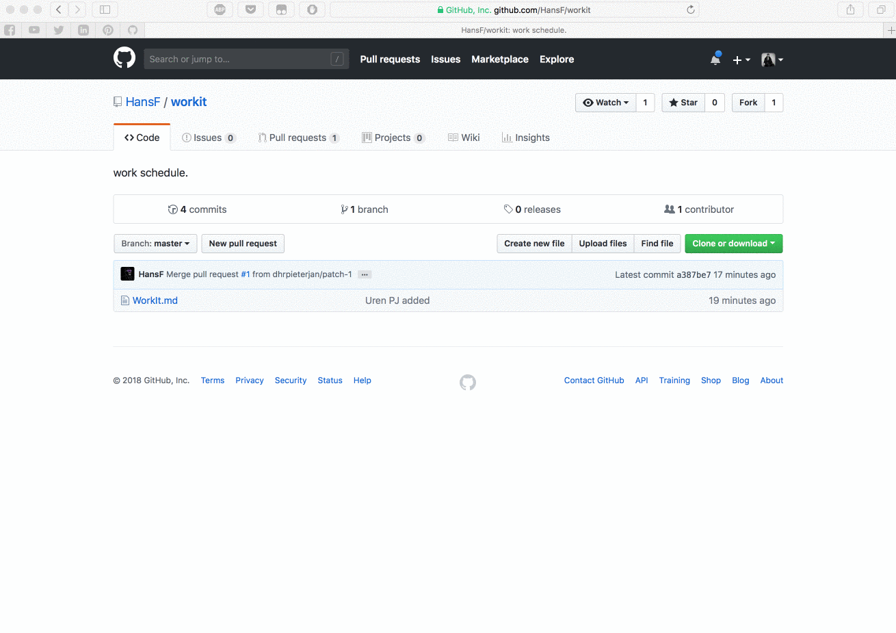

# The new Lab9K Admin site: Back to the Future with Markdown!

### Steps to add you hours:
1. Edit the file "workit.md"
2. Add a new line with te folowing template:
  - | NAME | HMON | HTH | HWE | HTH | HFR |
3. Add a commit message like "Workhours NAME added for week ##-##"
4. Create a pull request
5. You are only expected to work if your pull request is accepted!

### Workflow GIF

